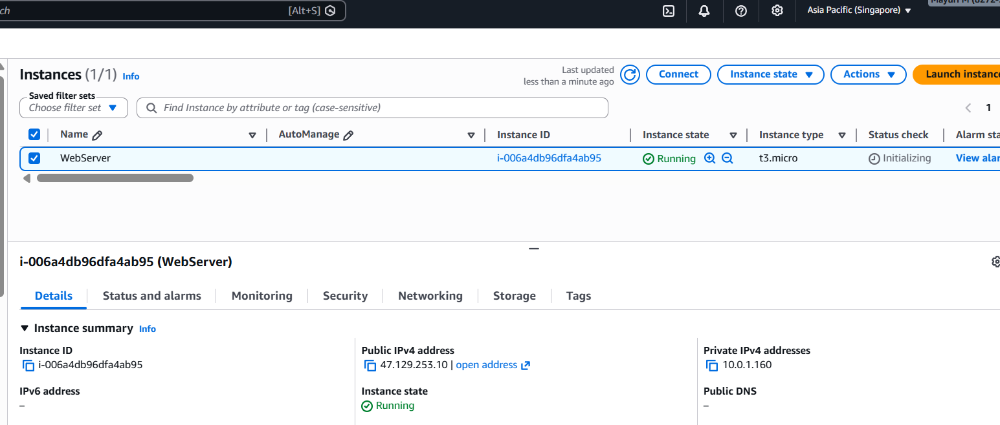
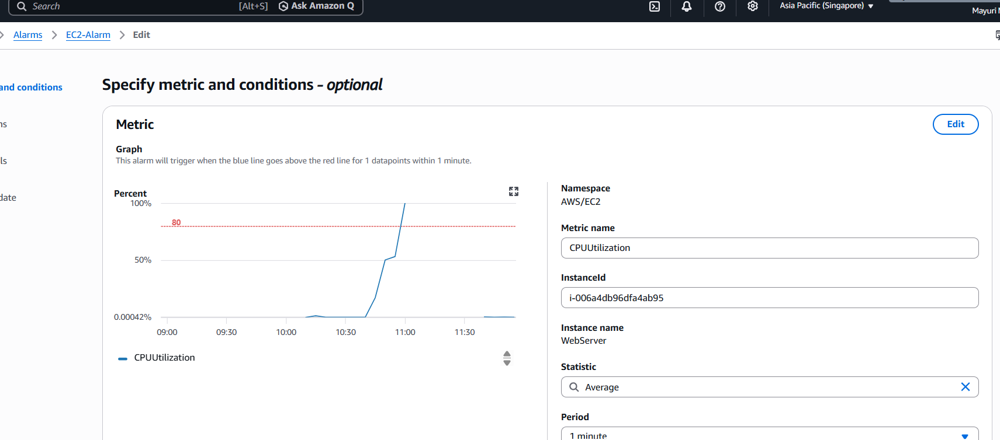
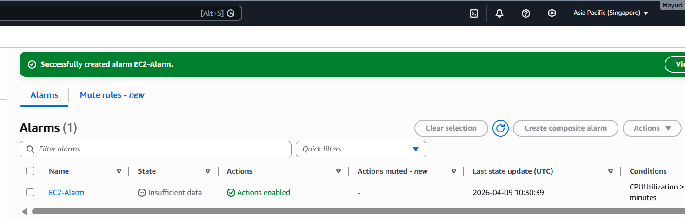
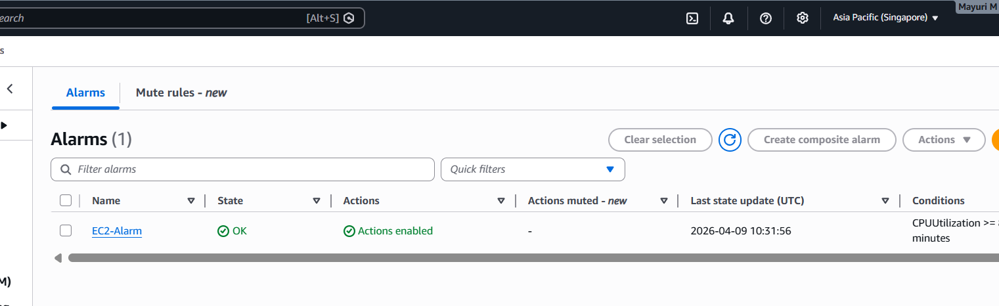
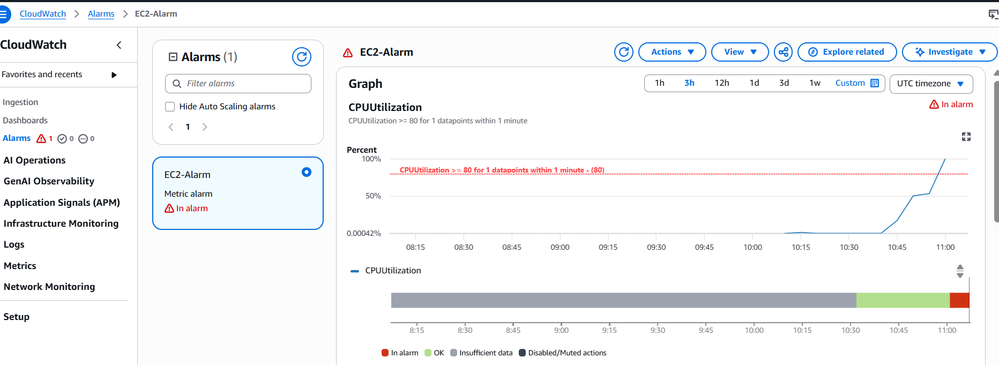
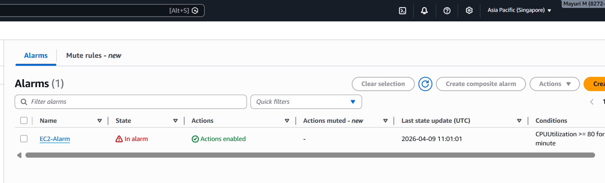
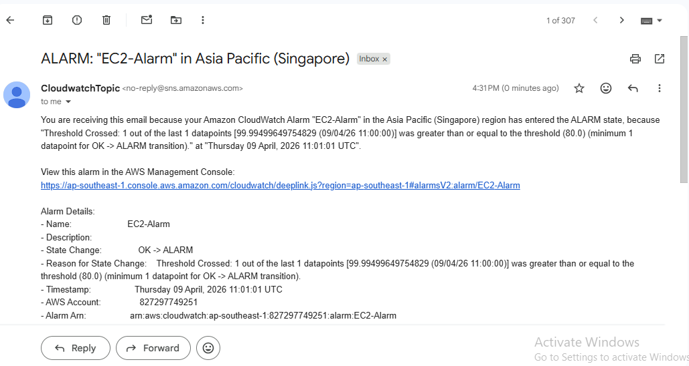

🚀 AWS CloudWatch EC2 Auto Stop using Alarm & SNS
________________________________________
📌 Problem Statement
High CPU utilization in an EC2 instance can lead to increased cost and performance degradation.
This project monitors CPU usage and automatically takes action when it exceeds a defined threshold.
________________________________________
🧠 Solution Overview
This project:
•	Monitors EC2 CPU utilization using CloudWatch
•	Triggers an alarm when CPU usage exceeds 80%
•	Sends email notification using SNS
•	Automatically stops the EC2 instance
________________________________________
🏗️ Architecture
 
________________________________________
⚙️ AWS Services Used
•	Amazon EC2
•	Amazon CloudWatch
•	Amazon SNS
•	AWS IAM
________________________________________
🔧 Implementation Steps
________________________________________
1️⃣ Created EC2 Instance
•	Launched EC2 instance
•	Enabled monitoring

 
________________________________________
2️⃣ Created CloudWatch Alarm
•	Metric: CPU Utilization
•	Threshold: Greater than 80%
•	Evaluation period configured

 
________________________________________
3️⃣ Alarm Initial State
•	Alarm starts in INSUFFICIENT_DATA

 
________________________________________
4️⃣ Normal Condition
•	CPU is below threshold
•	Alarm moves to OK state

 
________________________________________
5️⃣ High CPU Condition
•	CPU utilization exceeds 80%

 
________________________________________
6️⃣ Alarm Triggered
•	Alarm moves to ALARM state

 
________________________________________
7️⃣ SNS Notification
•	Email notification is sent when alarm is triggered

 
________________________________________
8️⃣ Automated Action
•	EC2 instance is automatically stopped

 
________________________________________
🧪 Testing
1.	Increased CPU usage manually
2.	Observed alarm state changes
3.	Verified email notification
4.	Confirmed EC2 instance stopped
________________________________________
🔐 Security
•	IAM roles used for permissions
•	SNS email subscription confirmed
________________________________________
💡 Key Learnings
•	CloudWatch monitoring and alarms
•	SNS notifications
•	AWS automation
•	Real-time infrastructure monitoring
________________________________________
🚀 Future Enhancements
•	Support multiple EC2 instances
•	Auto-start EC2 when CPU decreases
•	Use Lambda for advanced automation
•	Add CloudWatch dashboards
